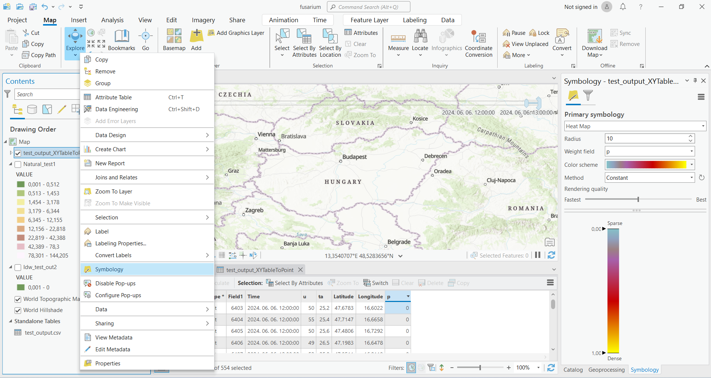
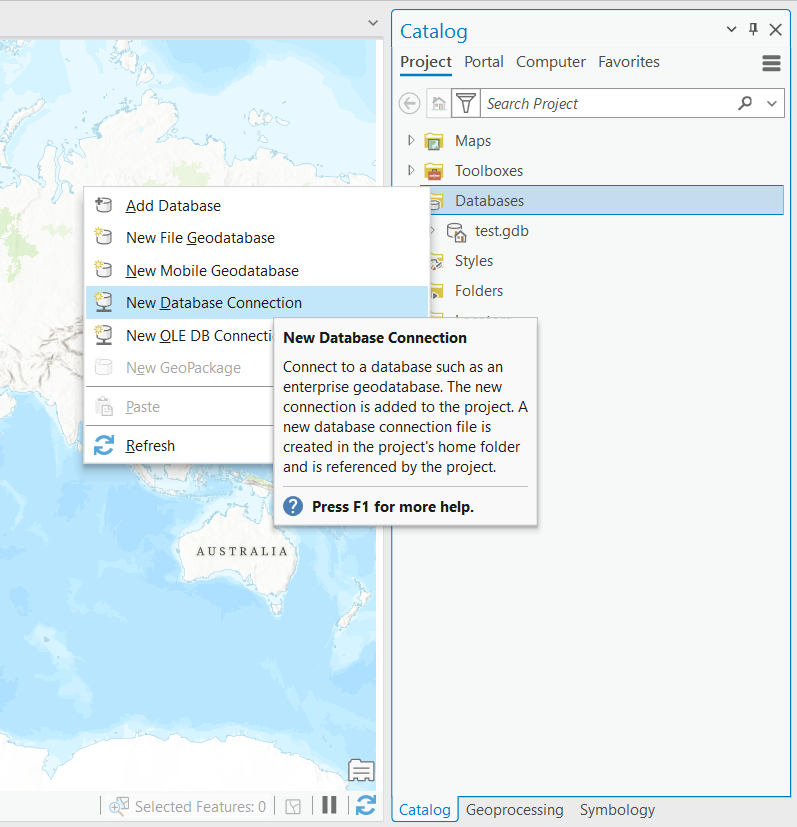
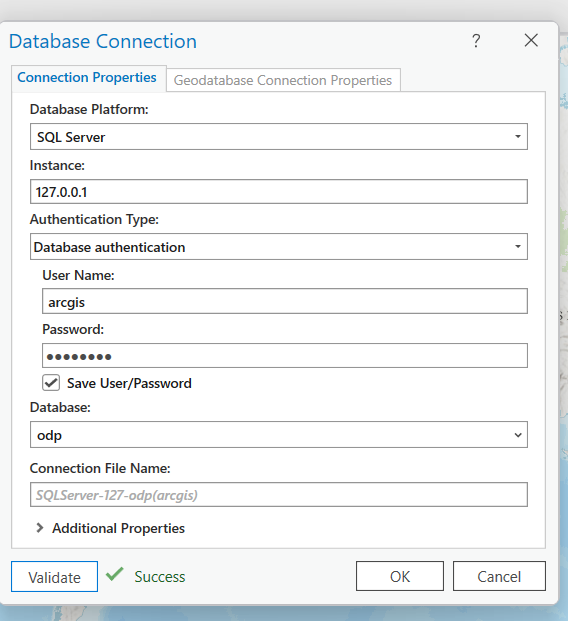
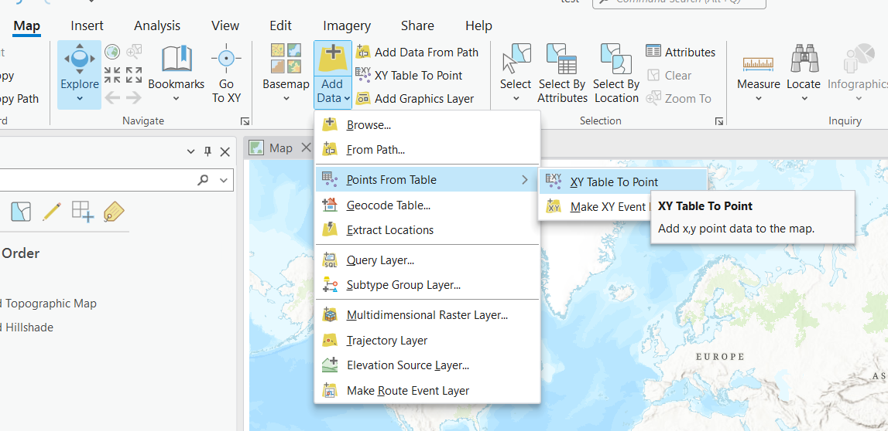

# FusariumMap - workplan

## Interaktív fuzárium térkép (Python web + ArcGIS / QGIS)
- ODP 1 órás gyakoriságú adatsor letöltése (folyamatos adatbázisba importálás)
    - folyamatos adatok: https://odp.met.hu/climate/observations_hungary/hourly/
    - napi adatok: https://odp.met.hu/weather/weather_reports/synoptic/hungary/hourly/
- MATE mérőállomások folyamatos betöltése (ehhez még kell hozzáférés)
- P% valószínűség számítás az egyes mérőállomásokra:
    - 7 napos mozgó átlag
    - p% = –3.3756 + 6.8128*TRH9010         (1)          ahol: p a fertőzés valószínűsége %-ban, TRH9010 a feltételeknek megfelelő (RH>90% és 15 °C<=Ta<=30 °C) egybefüggő óraszám (óra).
    - A virágzást megelőző és azt követő időszakban használható legjobb úgynevezett interakciós modell (2)
    - p% = –3.7251 + 10.5097*INT3 (2)          ahol: p a fertőzés valószínűsége %-ban,
    - INT3 a feltételeknek megfelelő virágzást megelőző 15 °C<=Ta<=30 °C és a virágzást követő RH>90% egybefüggő óraszám (óra). Az interakció a hőmérséklet súlyozott figyelembevételére vonatkozik.
- Interaktív (időszerűséget is mutató) térkép – az egyes pontok között interpolálva
 
## V1 verzió: Python / QGIS  és ArcGIS:
  1. ODP adatok letöltése, transzformálása megfelelő
  2. Térkép (Python / QGIS) lokális adatokból
  3. ArcGIS térkép lokális adatokból
## V2. Azure-ban lévő DB-be tölteni az adatokat folyamatosan
## V3. fájlszerverre menjen az OMSZ csv (adattranszformáció)
  - SQL szerver betölti CSV-t
  - ArcGIS VPN-en / remote desktop-n keresztül elérje a DB-t (MATE feladat)
  - ArcGIS Fuzárium térkép a MATE DB-ből

# Implementation 
## V1 verzió: Python / QGIS  és ArcGIS:
Loading the data:
### start database


```docker compose up```
-  postgres + pgadmin
- ```.env``` file
```
POSTGRES_PASSWORD=secret
PGADMIN_DEFAULT_EMAIL=admin@example.com
PGADMIN_DEFAULT_PASSWORD=secret
```

We can check (or delete) the tables using pgAdmin, that is also started by   ```localhost:15080``` using ```PGADMIN_DEFAULT_EMAIL``` and  ```PGADMIN_DEFAULT_PASSWORD```.

### Generating datatable with python:

Run the ```research.ipynb``` , that will pull last 7 days data from the database, and calculate ```p```


 - Start ArcGIS
 - Add Data  from top menu - chose output csv
 - Display XY data after right click - detects automatically coordinates -OK
 - Properties - Time - each feature has a single time filed - leave at "Time"
 - Symbology :


First result:


## V2 
- Data is stored in 3 mssql tables in database ```dbo``` 
- containerised python loading code each hours scheduled execution
- load the processed data into separate table: ````
  - download fresh data
    - check what we have already in db, download only those files what we dont have
    - load into base table
    - temp location, then remove files
    - load all historical data first? 
  - load previous day from fusarium table 
  - calculate recent p add to fusarium table new data rows  

## V3
- automise processing connection to database (under development)
- online pulblication (to be solved..)

### Data collection:

prerequistes:
 - [Git](https://git-scm.com/downloads)
 - [Docker](https://docs.docker.com/desktop/install/windows-install/)

Install and Run:
- in (for example ) Git Bash: ```git clone https://github.com/kppeterkiss/FusariumMap.git```
- ```cd FusariumMap```
- After starting Docker Daemon (Desktop) ```docker compose up```

### Connect from ARCGis:

Adding database:
1.

2. (pw and user in ```.env``` file)

3.

4.  Arcgis workflow state :

- **model builder/toolbox**
  - load data from db to feature class
  - select data interval
  - iterate by time over the chosen interval
  - interpolate raster from point measurements
  - add to time allowed mosaic dataset.
- manually:
  - allow time on mosaic
  - setup symbology


Result:


[Toolbox (atbx file)](./ArcGis_files/MyProject.atbx)

[Map (mpkx file)](./ArcGis_files/Map.mpkx)


# Dev notes
## Creating local env for development
```conda env create -f environment.yml```
```conda activate fusarium_env1```
```python -m ipykernel install --user --name=fusarium_env1
```

mssql date query :

```select * from dbo.fusarium where Time >= CONVERT(datetime, '2024-08-07 11:00:00', 20)```

```select * from dbo.fusarium where Time >= DATEADD(day, -1, GETDATE())```

```fusarium_XYTableToPoint1.Time > CURRENT_TIMESTAMP()-0.5```
in env file: 
```DB_HOST=postgres``` for running python in swarm, otherwise ```DB_HOST=postgres```

#https://docs.sqlalchemy.org/en/20/dialects/mssql.html

https://citizix.com/how-to-run-mssql-server-2019-with-docker-and-docker-compose/
https://stackoverflow.com/questions/70399243/how-to-fix-sql-server-2019-connection-error-due-to-certificate-issue


https://desktop.arcgis.com/en/system-requirements/latest/database-requirements-sqlserver.htm
https://pro.arcgis.com/en/pro-app/latest/help/data/databases/connect-sqlserver.htm

https://pro.arcgis.com/en/pro-app/latest/help/data/geodatabases/manage-postgresql/get-started-gdb-in-postgresql.htm

# ArcGis 
https://pro.arcgis.com/en/pro-app/latest/tool-reference/image-analyst/interpolate-from-spatiotemporal-points.htm#:~:text=Interpolates%20temporal%20point%20data%20into%20a%20multidimensional%20raster.,create%20a%20slice%20in%20the%20output%20multidimensional%20raster.

https://unidata.github.io/MetPy/latest/examples/gridding/Point_Interpolation.html

https://developers.arcgis.com/documentation/spatial-analysis-services/feature-analysis/analyze-patterns/interpolate-points/

https://pro.arcgis.com/en/pro-app/latest/help/data/imagery/time-in-a-mosaic-dataset-pro-.htm#:~:text=Mosaic%20datasets%20can%20be%20used%20to%20show%20multiple,Attribute%20mosaic%20method%2C%20or%20with%20the%20Time%20slider.

https://community.esri.com/t5/python-questions/iterate-dataset-and-workspace-to-add-rasters-to/td-p/656974

https://www.esri.com/arcgis-blog/products/js-api-arcgis/mapping/six-ways-to-visualize-change-over-time-in-web-maps/
we can delete with the admin rights, the python and the arcgis user can read and write?

checking out table only in enterprise licance   ??
https://pro.arcgis.com/en/pro-app/latest/tool-reference/tool-errors-and-warnings/001001-010000/tool-errors-and-warnings-00301-00325-000301.htm

Datetime diff 
https://www.esri.com/arcgis-blog/products/api-rest/data-management/querying-feature-services-date-time-queries/